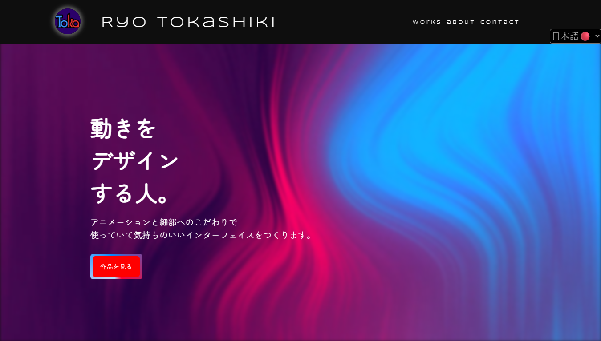
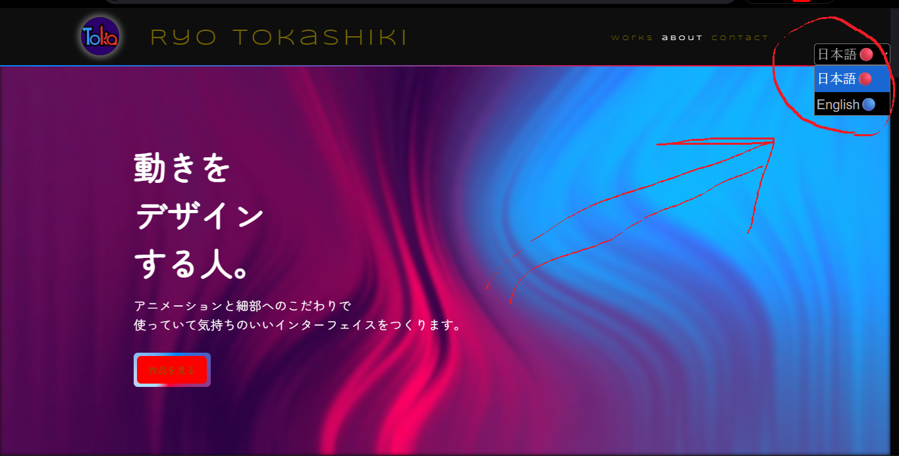
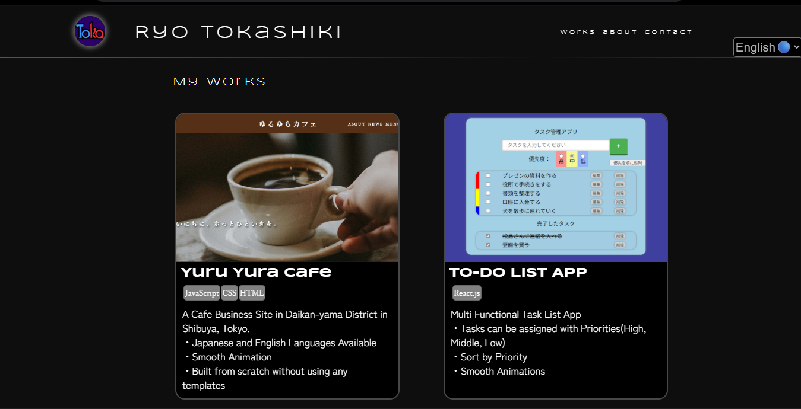

# こちらは私のポートフォリオサイトのランディングページの技術解説となっております。

使用技術：JavaScript,CSS,HTML

## 日英言語切り替え機能

私は日英の言語切り替え機能を実装いたしました。サイトの右上に「日本語」と書かれたタブがあるので\
それをクリックし、「English」を選択してもらうとサイト全体が英語表記に切り替わります。

英語表記へと切り替わります。

