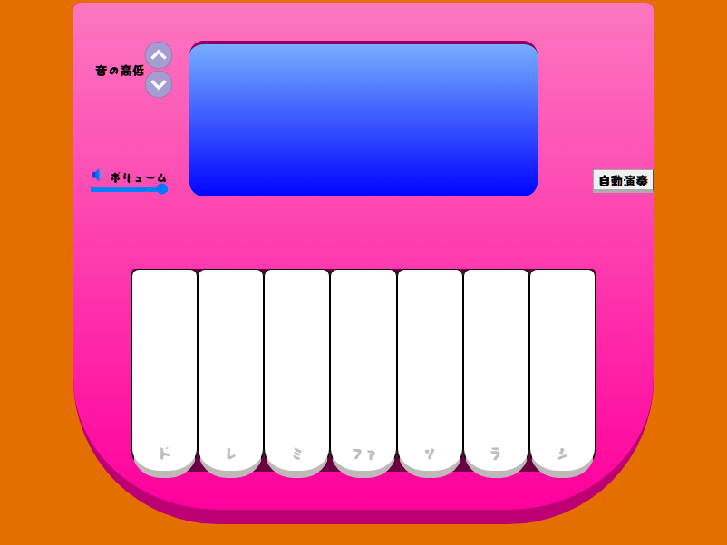

# こちらは私が制作した鍵盤アプリのリポジトリとなっております。
技術的な詳細を以下にて解説したいと思います。\
使用技術：jQuery,CSS,HTML


## ピアノアプリ
\
こちらのアプリはおもちゃのピアノをテーマにしたアプリで\
鍵盤をクリックすることで音が鳴ります。自動演奏ボタンを押すと「チューリップ」と「きらきらぼし」のいずれかがランダム再生される仕様となっております。\
左上の↑↓ボタンを押すとオクターブを上げたり下げたりして高音と低音を楽しめる仕様となっております。\
また、音量フェーダーで音量調節が可能、スピーカーのアイコンをクリックすることでミュートへ切り替えることもできます。

以下がHTMLの構造です
```HTML
<html lang="ja">
<head>
    <meta charset="UTF-8">
    <title>Piano App</title>
    <link rel="shortcut icon" href="#">
    <style>
      CSSコードがここにきます
    </style>
    <script src="https://code.jquery.com/jquery-3.7.1.min.js"></script>

</head>
<body>
<div class="container">
  <div class="displayContainer">
      <div class="display">
        <div class="letter">
      
      </div>
      <div class="letterInUpperDisplay">演奏中:</div>
      </div>
          <div class="autoPlay">
            <button class="autoPlayButton" onclick="startAutoPlay()">
              自動演奏
            </button>
          </div>
          <div class="sliderContainer">
            <div class="volume"><span>  </span>ボリューム</div>
            <input type="range" min="0" max="100" value="100" class="slider" id="volumeSlider">
              
          </div>
          <div class="octaveShifterContainer">
            <p class="octave">音の高低</p>
            <div class="octaveButtonContainer">
            </img>
            </img>
            </div>
          </div>

  </div>
  
  <div class="keys">
    <div class="key do" onclick="if(!isPlaying){showNote('ド');playTone('ド')}"><div class="letters do">ド</div></div>
    <div class="key re" onclick="if(!isPlaying){showNote('レ');playTone('レ')}"><div class="letters re">レ</div></div>
    <div class="key mi"onclick="if(!isPlaying){showNote('ミ');playTone('ミ')}"><div class="letters mi">ミ</div></div>
    <div class="key fa" onclick="if(!isPlaying){showNote('ファ');playTone('ファ')}"><div class="letters fa">ファ</div></div>
    <div class="key so" onclick="if(!isPlaying){showNote('ソ');playTone('ソ')}"><div class="letters so">ソ</div></div>
    <div class="key ra" onclick="if(!isPlaying){showNote('ラ');playTone('ラ')}"><div class="letters ra">ラ</div></div>
    <div class="key shi"onclick="if(!isPlaying){showNote('シ');playTone('シ')}"><div class="letters shi">シ</div></div>


  </div>

</div>


<script>
jQueryコードがここにきます
</script>

</body>
</html>
```


