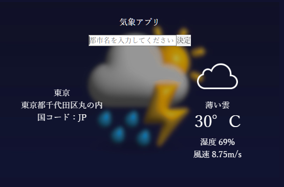

# こちらは私が制作した気象アプリのリポジトリとなっております。
技術的な詳細を以下にて解説したいと思います。\
使用技術：外部API/JavaScript,CSS,HTML


## 気象アプリ
\
こちらのアプリは都市名を入力するとその都市の現在気温、湿度、風向き、天候等の気象情報が表示されるアプリとなっております。\
日本語と英語対応となりますので、「東京」「tokyo」どちらも対応できます。

以下がHTMLの構造です
```HTML
<!DOCTYPE  html>
<html lang="ja">
    <head>
    <meta charset="UTF-8">
    <title>気象アプリ</title>
        <meta name="viewport" content="width=device-width, initial-scale=1.0"> 
      <link rel="stylesheet" type="text/css" href="reset.css">
    <style>
    </style>
    </head>
    <body>
      <div class="image_container">
      <div class="wholeContainer">
        
        <p class="title">気象アプリ</p>
        <div id="input_container">
        <input type="text" placeholder="都市名を入力してください">
        <button id="submit">決定</button>
        </div>


        <div id="information_panel" class="raws">
          <ul>
            <li id="input_city" class="raws"></li>
            <li id="city_name" class="raws"></li>
            <li id="country_code" class="raws"></li>
         
            
            <li id="updated_date" class="raws"></li>
          </ul>
          <ul id="right_pannel">
               <li id="weather_icon" class="raws">
              
            </li>
            <li id="weather" class="raws"></li>
            <li id="temperature" class="raws"></li>
            <li id="feelsLike" class="raws"></li>
            <li id="humidity" class="raws"></li>
            <li id="wind" class="raws"></li>
          </ul>


        </div>
</div>
</div>


</div>

  <script src="weather_app.js" type="module"></script><!--Where to put JS sheet is before the closing body tag.   -->
    </body>
</html>
```


以下がJavascriptのコードとなっております。
```JavaScript
// API KEYを別ファイルからインポート↓↓////
import{API_KEY} from"./config.js";

let text_field = document.querySelector("input");
let decide_button = document.getElementById("submit");
let city_name_li = document.getElementById("city_name");
let country_code_li=document.getElementById("country_code")
let temp_li = document.getElementById("temperature");
let feelsLike_li = document.getElementById("feelsLike");
let humidity_li=document.getElementById("humidity");
let wind_li=document.getElementById("wind");
let weather_li=document.getElementById("weather");
let the_ul=document.getElementById("ul");
let all_lis=Array.from(document.querySelectorAll("li"));
let input_city=document.getElementById("input_city");
let img=document.querySelector("img");
let weather_icon_li=document.getElementById("weather_icon");

let city_name=null;
let country_code=null;
let humidity = null;
let wind=null;
let weather=null;
let temperature=null;
let weather_id=null;

window.addEventListener("keydown",(e)=>{
if(e.key=="Enter" && document.activeElement===text_field){
        decide();
}
})


function kel_to_cel(kelvin){
        let cel_temp=Math.trunc(kelvin-273.15);
        return cel_temp
}


function icon_decide(weather_id){
if(200<=weather_id&&weather_id<300){
        img.src="assets/images/compressed_images/icons8-storm-100.png"
}else if(300<=weather_id&&weather_id<600){
        img.src="assets/images/compressed_images/icons8-raining-96.png"
}else if(600<=weather_id&&weather_id<700){
         img.src="assets/images/compressed_images/icons8-cloud-100.png"

}else if(700<=weather_li&&weather_id<800){
        img.src="assets/images/compressed_images/icons8-mist-96.png"

}else if(weather_id===800){
         img.src="assets/images/compressed_images/icons8-sunny-100.png"

}else if(800<weather_id){
         img.src="assets/images/compressed_images/icons8-cloud-100.png"

}


}


async function decide(){
let input_value = text_field.value.trim();
console.log("input_value is.."+input_value);


if(!input_value){
        alert("都市名を入力してください！");
}


await fetching();


async function fetching(){

let geocoding_api_query= `https://api.openweathermap.org/geo/1.0/direct?q=${input_value}&limit=1&appid=${API_KEY}`      
let geocoding_api_response= await fetch(geocoding_api_query);     

let resolved1=await geocoding_api_response.json();


if(resolved1.cod==="404"){
        alert("都市が見つかりませんでした。")
        text_field.value="";
        return
}


console.log(resolved1)
if(resolved1.length>0){

        let latitude=resolved1[0].lat;
        let longitude=resolved1[0].lon;
        country_code=resolved1[0].country;
        console.log("country code is.."+country_code);
        console.log("latitude is..."+latitude);
        console.log("longitude is..."+longitude);

        let weather_api_query=`https://api.openweathermap.org/data/2.5/weather?lat=${latitude}&lon=${longitude}&lang=ja&appid=${API_KEY}`
        let weather_api_response = await fetch(weather_api_query);
        console.log("sent query is.."+weather_api_query);

        let resolved2=await weather_api_response.json();
        if(resolved2.cod==="404"){
                alert("都市が見つかりませんでした。")
                text_field.value="";
                return
        }


        console.log(resolved2);
        city_name = resolved2.name;
        console.log(city_name);
        // country_code=resolved2
        temperature=Number(resolved2.main.temp);
        humidity=resolved2.main.humidity;
        wind=resolved2.wind.speed;
        weather=resolved2.weather[0].description;
        console.log("weather code is..."+weather);
        weather_id=Number(resolved2.weather[0].id);
        console.log(weather_id);
        icon_decide(weather_id);
        
        input_city.innerHTML=input_value
        city_name_li.innerHTML = city_name;
        country_code_li.innerHTML="国コード："+country_code;
        temp_li.innerHTML = `${kel_to_cel(temperature)}${"&deg;C"}`;
        humidity_li.innerHTML="湿度 "+humidity+"%";
        wind_li.innerHTML="風速 "+wind+"m/s";
        weather_li.innerHTML=weather;
        text_field.value="";
}else{      
text_field.value="";
all_lis.forEach((item)=>{
item.innerHTML="";
city_name_li.innerHTML = "取得できませんでした。<br>次の入力をどうぞ。";
img=document.createElement("img");
weather_icon_li.appendChild(img);


})
}  
}

}

decide_button.addEventListener("click",()=>{

decide()

})
```

以下がCSSのコードとなっております

```CSS

        *{
          box-sizing:border-box;
          margin:0;
          padding:0;
        }


          body, html {
            display: flex;
            justify-content: center;
            align-items: flex-start;
            width: 100%;
            min-height: 100%;
            background: #11122f;
        }


        
      .wholeContainer{
        margin: 1rem;
        /* box-shadow: 0px 0px 5px gray; */
        border-radius:15px;
        min-width: 50vw;
        display:flex;
        justify-content: center;
        align-items: center;
        flex-direction: column;
        padding: 1rem 0;
        min-height: 20vh;
        background: #11122f;
        background-image:url(assets/images/compressed_images/abid-shah-sff8Ow-YiWY-unsplash.jpg);
        background-repeat:no-repeat;                    
        background-size:80%;
         background-position: 50% 37%;
        min-height: 40vh;

            z-index: 1;
      }
      .upperHalfContainer{
        position: relative;
        width: 100%;
        display: flex;
        justify-content: center;
        align-items: center;
                height: 17vh;
      }

      #information_panel{
        width: 89%;
        margin: 1rem;
            display: flex;
      }


.addButton {
    padding: 10px 20px;
    background-color: #4CAF50;
    color: white;
    border: 0;
    border-bottom: 5px solid #367039;
    border-radius: 4px;
    cursor: pointer;
    transition: all 0.03s ease;
         margin-top: 6vh;
       
    left: 0%;
    max-height: 10vh;
    max-width: 10vh;
    font-size: 1.3rem;
}
.addButton:hover {
  background-color:#78e37b;
  border-bottom:5px solid #66c26b;;
}
.addButtonPushed{
  background-color: #63c266;
  border-bottom:0px!important;
  transform:translateY(5px);
  transition:all 0.03s ease;
} 
      .inputContainer{
        display: flex;
        flex-direction: column;
        justify-content: center;
            width: 100%;
      }
      .devidingContainer2 p{
        text-align: center;
            margin: 1rem;
          
      }

      .devidingContainer1,.devidingContainer3{
        width: 20%;
        height: 100%;
      }
      .devidingContainer3{
        position: relative
      }

      .devidingContainer2{
        width: 60%;
            height: 100%;
      }

      #inputField{
        height: 2rem;
            box-shadow: inset 0px 0px 4px gray;
            border: none;
            padding: 1rem;
                font-size: 0.9rem;
                width: 100%;
                margin-right:1rem;
      }
      input:focus{
        outline:none;
      }
      #input_container{
        display: flex;
      }

      ul{
        border-radius:15px;
        
        max-width: 100%;
        width: 100%;
        overflow: hidden;
        background-color: transparent;
      }
     
    

      li{
        list-style-type:none;
        display: flex;
      
        padding: 5px 20px;
        overflow: hidden;
            display: flex;
    justify-content: space-between;
      }

      ul
 {
    padding-left: 0;
    display: flex;
    flex-direction: column;
    justify-content: center;
    align-items: center;
}
li#temperature {
    font-size: 2rem;
}


      .completed{
        text-decoration: line-through;
      }
      
      .pritorityContainer{
        display: flex;
        justify-content: center;
      }

      #sort{
        position: absolute;
        right:0px;
        bottom: 0;
        font-size: 12px;
        width: 100%;

      }

      .priority1{
        border-left:10px red solid;
      }
      .priority2{
        border-left: 10px yellow solid;
      }
      .priority3{
        border-left: 10px blue solid;
      }
      
      
      .taskCompleted{
      animation-name:completed;
      animation-timing-function: ease;
      animation-duration:0.25s;

      }
      @keyframes completed{
      from{opacity:1;
                  max-height: 2rem;
      }
      to{opacity:0;
            max-height: 0rem;
      }
      }


            .receivingInCompletedList{
      animation-name:receiving;
      animation-timing-function: ease;
      animation-duration:0.25s;
      }

      @keyframes receiving{
      from{opacity:0;
                  transform:translateY(-30px);
      }
      to{opacity:1;
            transform:translateY(0px);
      }
      }

      .smoothGrowing{
        animation :growingDown 0.25s ease;
      }
      @keyframes growingDown{
      from{opacity:0;
                  max-height: 0rem;
      }
      to{opacity:1;
            max-height: 2rem;
      }
      }

      .uncompletedListContainer{
            width: 89%;
            margin: 1rem 0rem;
      }
      .completedListContainer {
    width: 100%;
    display: flex;
    flex-direction: column;
    justify-content: center;
    align-items: center;
}

      .header{
        text-align: center;
        margin-bottom: 1rem;
      }

      .choiceWrapper1{
       background-color: rgb(248, 147, 147);
       display: flex;
       flex-direction: column;
       width: 2rem;
       justify-content: center;
       align-items: center;
      }
       .choiceWrapper2{
       background-color: rgb(243, 248, 147);
          display: flex;
       flex-direction: column;
        width: 2rem;
       justify-content: center;
       align-items: center;
      }
       .choiceWrapper3{
       background-color: rgb(147, 177, 248);
          display: flex;
       flex-direction: column;
        width: 2rem;
       justify-content: center;
       align-items: center;
      }

      .priority-title{
        display: flex;
        justify-content: center;
        align-items: center;
      }
p.title{
  margin:1rem;
  color: white;
}


      .smoothDelete{
        animation :smoothDelete 0.15s ease;
      }

         @keyframes smoothDelete{
      from{opacity:1;
                  max-height: 2rem;
      }
      to{opacity:0;
            max-height: 0rem;
      }
      }
      ul.completed{
            width: 89%;
            margin: 1rem 0rem;
      }
      button {
    border: none;
    box-shadow: 0px 0px 1px gray;
    color: #4c4c4c;
}

.buttonWrapper{
      display: flex;
    overflow: hidden;
    border-radius: 5px;
}

.li_button{
  margin-right: 10px;
  border-radius: 6px;
  font-size: 0.7rem;
  box-shadow: 0px 0px 5px gray;
  background-color: #cfcfcf;
      padding: 0px 5px;
}


.completedListContainer ul{
  width: 89%;
}

button.reset {
    color: black;
    position: fixed;
    bottom: 0;
    right: 0;
    background: gray;
    z-index: 100;
}

.resetWindow{
  color: black;
    position: fixed;
    bottom: 0;
    right: 0;
    background: gray;
 
      height: 10vh;
    width: 14vh;
display: flex;
flex-direction: column;
   display: none;
   z-index:100;
}

.raws{
  text-align: center;
  color:white;
}

.resetButtonContainer button {
    margin-right: 4%;
    width: 50%;
    font-size: 0.6rem;
}

.resetButtonContainer {
    display: flex;
}

.show{
  display: flex;
}
.hide{
  display: none;
}

.visibilityHidden{
  visibility: hidden;
}

.borderTransparent{
  border-left: 10px transparent solid;
}

@media (max-width: 768px) {

  * {
    font-size: 0.9rem;
}

  .wholeContainer{
    width: 70vw
  }

.li_button {
    margin-right:null;
}

span {
    width: 32vw;
}


}

@media (max-width: 480px) {
.li_button {
    font-size: 10px;
    margin: 0;
}

*{
      font-size: 0.84rem;
    
}

    .wholeContainer {
        width: 85vw;
    }

.devidingContainer2 p {
    font-size: 0.9rem;
    margin: 0.8rem;
}


.addButton {
    margin-top: 5vh;
}

#inputField {
    font-size: 0.6rem;
}

#sort {
        font-size: 0.6rem;
}


}

```


