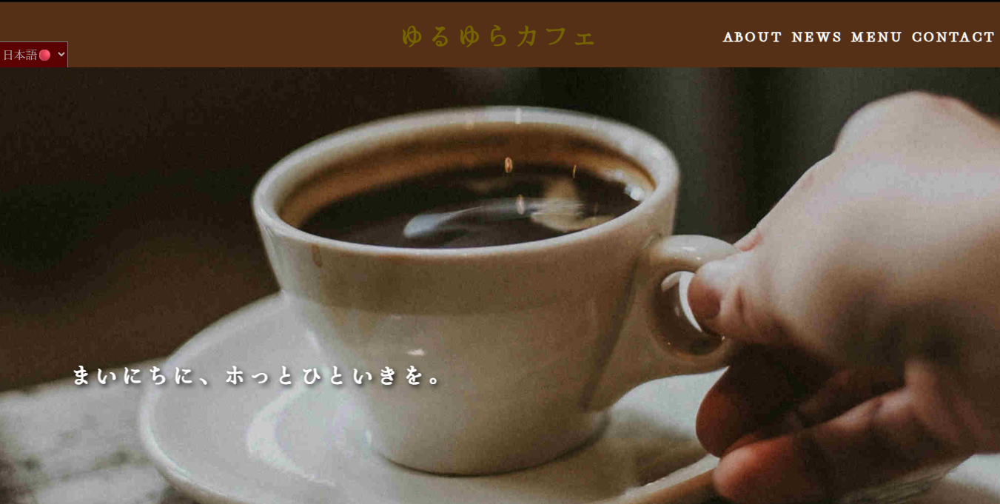

## こちらは私が制作した架空のビジネスカフェサイトのリポジトリとなっております。
技術的な詳細を以下にて解説したいと思います。
### ヒーロースライド

トップ画面を開いたらすぐに見えるカフェの写真3枚のスライドです。\
こちらはJavascriptは使っておらず、CSSのみで完結させました。

以下がHTMLの構造です
```HTML
      <section class="hero" >
            <p class="message" data-i18n="slogan">まいにちに、<span class="break">ホっとひといきを。</span></p>
            <div class="heroSlide first"></div>
            <div class="heroSlide second"></div>
            <div class="heroSlide third"></div>
      </section>

```


以下はCSSコードとなっております。\
ヒーロースライドのコンテナです
```CSS

      .hero{
        position: relative;
        width: 100%;
        overflow: hidden;
        height: 87vh;
        display: flex;
        align-items: flex-start;    
        justify-content: flex-start; 
        padding-top: 58vh;
        padding-left: 14vh; 
      }
```


そしてこれはヒーロースライドの各画像（計3枚）のクラスです。
```CSS
      .heroSlide{　/*各スライド画像共通のクラス*/
        box-sizing:border-box;
        background-repeat:no-repeat;
        background-size:cover;
        background-position:center;
        /* position manipulation*/
        z-index:1;
        height: 100%;
        background-attachment: fixed;
      }

      .heroSlide.first{     /*一枚目のスライド画像*/
        background-image:url(assets/images/compressedImages/snapbythree-my-g6e641CiHFQ-unsplashKai.jpg); 
        animation:fadeInOutFor1 15s linear forwards; /*delay -secondsを使うとなんか表示の周期がずれておかしくなるからつかわないほうがいい*/
        z-index: 5;
        animation-iteration-count: infinite;
        top: 0;
        left: 0;
        width: 100%;
        position: absolute;
        background-position:50% 65%;
      }

      .heroSlide.second{　/*二枚目のスライド画像*/
        background-image:url(assets/images/compressedImages/kieran-ReVIa_Nm6fE-unsplashKai.jpg);
        position: absolute;
        top: 0;
        left: 0;
        z-index: 4;
        animation:fadeInOutFor2 15s linear forwards;
        width: 100%;
        animation-iteration-count: infinite;
        background-position:10% 49%;

      }

      .heroSlide.third{ /*三枚目のスライド画像*/
        background-image:url(assets/images/compressedImages/zarak-khan-69ilqMz0p1s-unsplashKai.jpg);
         position: absolute;
        top: 0;
        left: 0;
        z-index: 3;
        width: 100%;
        animation:fadeInOutFor3 15s linear forwards;
        animation-iteration-count: infinite;
        opacity: 0;
      }
```

以下が各スライドへ適用する keyframes　アニメーションです。
```CSS
       @keyframes fadeInOutFor1{/*1枚目の画像用のkeyframeアニメーション*/
        /*Since there are 3 slides, 100/3=33
        だから100%を三分割して1/3の間だけ表示
        のこりの2/3の間は非表示にする
        
        */
        0%{opacity: 1;
         transform: scale(1.02);}
          6%{opacity: 1;
            
          }


          33%{opacity: 1;}
          39%{opacity: 0;
                  transform: scale(1.25);
                }

          94%{opacity: 0;
           transform: scale(1);}
          100%{opacity: 1;
          transform: scale(1.02); }
      }


      @keyframes fadeInOutFor2{ /*2枚目の画像用のkeyframeアニメーション*/
        0%{opacity: 0;
                  }

        27%{opacity: 0;}
        
        33%{opacity: 1;
                transform: scale(1.25) translateX(0);    
                }

        66%{opacity: 1;
                }

        72%{opacity: 0;}

        100%{opacity: 0;
                    transform: scale(1.25) translateX(-15%)
                  }
/* only 1/3 of this is shown */

      }

        @keyframes fadeInOutFor3{ /*3枚目の画像用のkeyframeアニメーション*/
        0%{opacity: 0;
                  }

       
        66%{opacity: 0;
                }

        68%/*72%*/{opacity: 1;
                  transform: scale(1.25) translateY(-7%);}

        100%{opacity: 1;
                    transform: scale(1.25) translateY(0%)
                  }
/* only 1/3 of this is shown */

      }


```
基本的には3枚の画像が重なっており、それら各画像に個別のkeyframeのアニメーションがかかっています。\
このkeyframeアニメーションの内容は主にopacityの　0と1の切り替えです。\
スライドが1から3枚目まで表示される、スタートからフィニッシュまでを100％の期間とすると、\
各スライドが表示される期間（opacity:1)が各33％ととなって残りの66％は非表示の期間(opacity:0)となっております。\
keyframeアニメーションも各画像用に個別に用意してあります。計3つあります。

第一枚目の画像は0%~33%の間opacity:1、33％~100%の間はopacity:0です。\
第二枚目の画像は0%~33%の間opacity:0、33%~66%の間はopacity:1、そして66%~100%の間はopacity:0　となっております。\
第三枚目の画像は0%~66%の間opacity:0、66%~100%の間はopacity:1　となっております。


